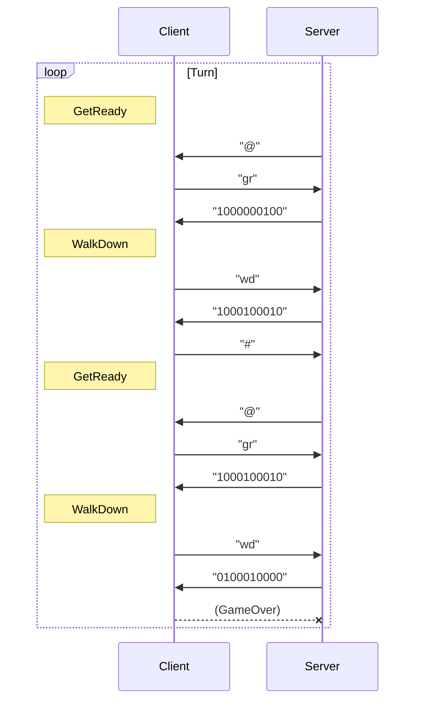

```mermaid
sequenceDiagram
    participant Client
    participant Server
    loop Turn
        Note Left of Client: GetReady
        Server->>Client: "@"
        Client->>Server: "gr"
        Server->>Client: "1000000100"

        Note Left of Client: WalkDown
        Client->>Server: "wd"
        Server->>Client: "1000100010"
        Client->>Server: "#35;"

        Note Left of Client: GetReady
        Server->>Client: "@"
        Client->>Server: "gr"
        Server->>Client: "1000100010"

        Note Left of Client: WalkDown
        Client->>Server: "wd"
        Server->>Client: "0100010000"
        Client--XServer: (GameOver)
    end
```